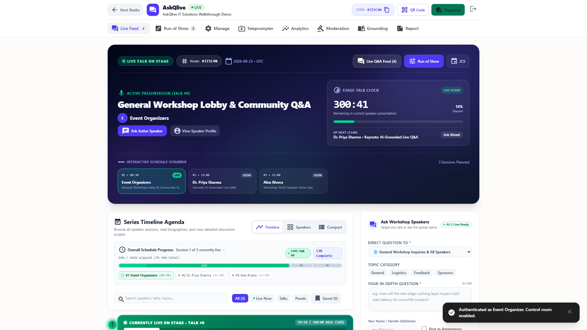
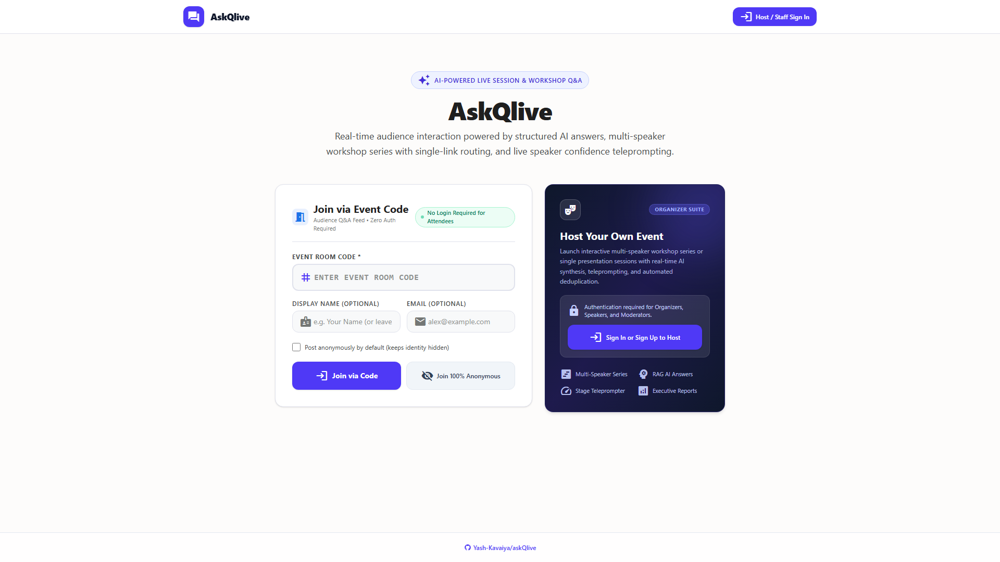
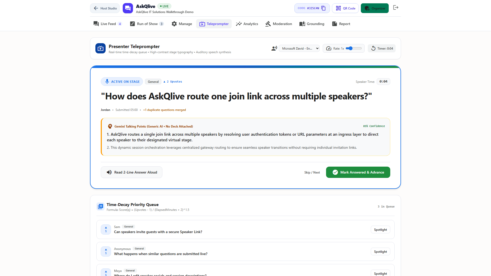
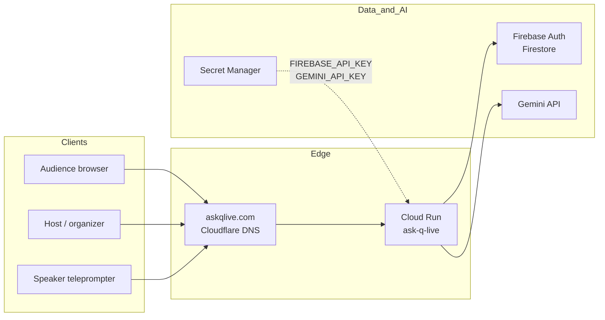
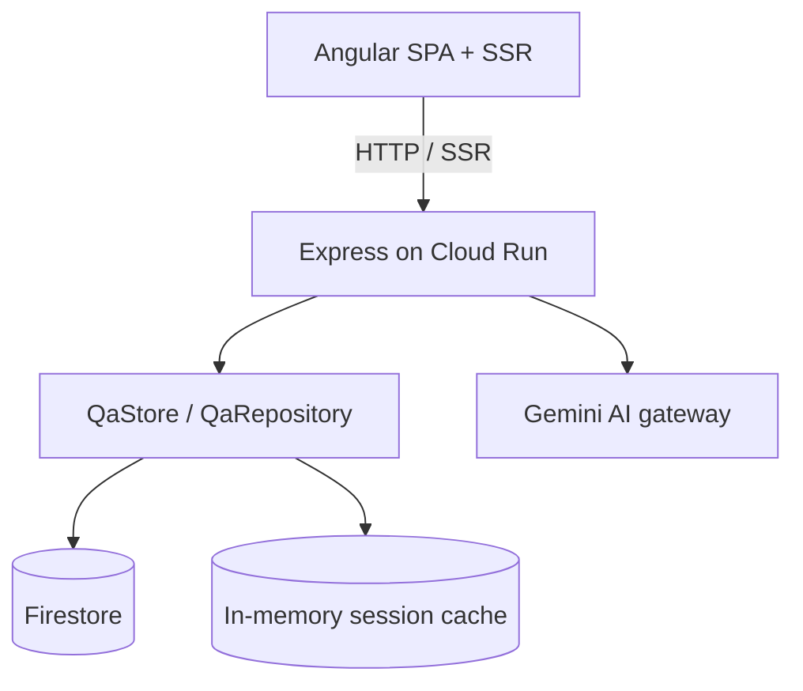
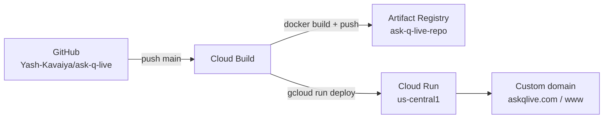

# AskQlive

**Live Q&A for multi-speaker events — one join code, real-time moderation, AI answers, and a presenter teleprompter.**

Product: [askqlive.com](https://askqlive.com) · Cloud Run: [ask-q-live service](https://ask-q-live-wc5dzwjbtq-uc.a.run.app)



*Host control room: live question feed, stage controls, and run-of-show in one surface.*

---

## Why this exists

Live events still run Q&A on a fragile stack: Slack threads, sticky notes, random Mic-drop chaos, or tools that force every attendee to create an account before they can ask a question. Organizers lose the signal. Speakers lose confidence. Moderators drown in duplicates.

**AskQlive collapses that stack into one purpose-built flow:**

| Pain today | What AskQlive does |
|------------|--------------------|
| Audience friction (sign-up walls) | Zero-auth join with a short code / QR |
| Questions scatter across chat apps | One live feed with upvote ranking |
| Multi-speaker events have no “room” | Series + segments with speaker invites |
| Hosts can’t see what to say next | Stage queue + teleprompter for presenters |
| No post-event learning | Analytics and AI-assisted summaries |
| Ops glue across Zoom / Slido / docs | One product for join → moderate → present → measure |

### Who it is for

- Conference and meetup organizers  
- Enterprise town-hall / all-hands hosts  
- Workshop facilitators and keynote teams  
- Multi-speaker panels that need a clear run of show  

### What problem it solves (in detail)

1. **Access friction kills participation.** Most tools optimize for accounts, not moments. AskQlive optimizes for *seconds to first question* — enter a join code and ask.
2. **Signal vs noise.** Without ranking and moderation, the loudest chat wins. Upvotes, host approve/reject, and a curated stage queue keep the room focused.
3. **Multi-speaker reality.** Real events are not one perpetual session. AskQlive models **series → segments**, with per-speaker invites, socials, and session descriptions.
4. **Presenter confidence.** Knowing the next question under lights matters. The **teleprompter** surface is built for the person on stage, not the person in the ops channel.
5. **AI where it helps, not where it distracts.** Gemini powers OCR/context, suggested answers, and post-session reports — under host control, not as a replacement for moderation.
6. **Operability.** Docker → Artifact Registry → Cloud Run, with Secret Manager for keys and a GitHub → Cloud Build trigger so `main` deploys itself.

---

## Product at a glance



*Join landing — code or QR, no account required for attendees.*



*Teleprompter — large, stage-readable next question for speakers.*

### Core capabilities

- **Join & ask** — short codes, share links, QR  
- **Live feed** — upvote, pin, approve, ban as needed  
- **Host studio / control room** — moderation + stage  
- **Manage Series** — multi-segment run of show  
- **Speaker invites & profiles** — socials, bios, segment topics  
- **Teleprompter** — presenter-facing view  
- **Analytics** — engagement during and after the session  
- **AI assists** — document grounding, suggested answers, reports (Gemini)

---

## Architecture

### System context



### Request path (runtime)



### Deploy pipeline



### Why this shape is useful

- **Cloud Run** — scale to zero between events; burst when a keynote starts  
- **SSR Angular** — fast first paint and shareable links that resolve on the server  
- **Firebase** — auth for organizers + durable series/session data  
- **Secrets outside the image** — keys rotate without rebuilding  
- **One domain mapping** — revisions change; `askqlive.com` does not  

---

## Tech stack

| Layer | Choice |
|-------|--------|
| UI | Angular 21, Angular Material, Tailwind-style utility classes |
| Server | Express + Angular SSR |
| Auth / DB | Firebase Auth, Cloud Firestore |
| AI | Google Gemini (`@google/genai`) |
| Runtime | Docker on Google Cloud Run (`us-central1`) |
| CI/CD | Cloud Build (`cloudbuild.yaml`) on push to `main` |
| DNS | Cloudflare → Cloud Run domain mapping |
| Analytics | Google Analytics (`G-V2Q44SS4M9`), Microsoft Clarity |

**GCP + Firebase project (single):** `gen-ai-guru-gdg-pune`  
**Service:** `ask-q-live` · **Firestore:** `(default)` · **Auth:** Firebase Auth in the same project

---

## Quick start (local)

```bash
npm install
cp .env.example .env   # set GEMINI_API_KEY and FIREBASE_API_KEY
npm run dev            # http://localhost:3000
```

Useful scripts:

| Command | Purpose |
|---------|---------|
| `npm run dev` | Local UI + API with HMR |
| `npm run build` | Production client + SSR bundle |
| `npm test` | Vitest unit tests |
| `npm run test:e2e` | Playwright suite |

---

## Deployment model

1. Push to `main` on GitHub.  
2. Trigger `ask-q-live-main-deploy` runs `cloudbuild.yaml`.  
3. Image lands in Artifact Registry; Cloud Run rolls a new **revision**.  
4. Service URL and custom domain stay stable — no DNS change per release.

Secrets on Cloud Run:

- `GEMINI_API_KEY` ← Secret Manager `gemini-api-key`  
- `FIREBASE_API_KEY` ← Secret Manager `firebase-api-key`  

One-time GCP bootstrap (reference): `setup-gcp.sh`.

---

## Repository map

```text
src/app/           Angular UI (host studio, join, series, teleprompter, …)
src/server/        Express API, QaStore, Gemini gateway, auth helpers
src/server.ts      SSR composition root + allowedHosts
cloudbuild.yaml    Build → Artifact Registry → Cloud Run
Dockerfile         Production image
assets/readme/     README screenshots
docs/              Specs / plans (large pitch & video trees are gitignored)
```

---

## Justification summary

AskQlive is useful because it treats live Q&A as an **event operations problem**, not a chat widget:

1. **Lower the cost of asking** → more real questions.  
2. **Raise the cost of noise** → moderation + ranking.  
3. **Respect the stage** → teleprompter and run-of-show.  
4. **Respect the calendar** → multi-speaker series, not a single endless room.  
5. **Ship like a product** → Cloud Run + CI/CD + custom domain, not a demo that dies after the meetup.

---

## License / status

Private application repository. Product surface: **askqlive.com**.
